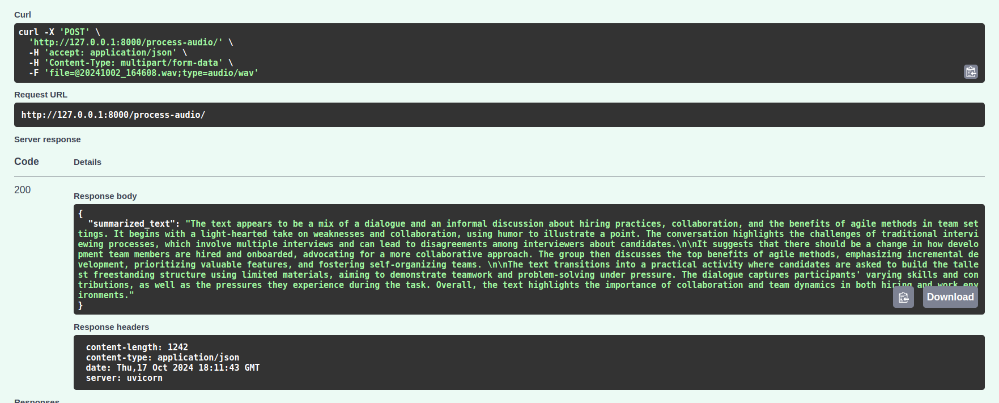

# Multi-Speaker-Audio-Summarizer

This project is a FastAPI-based web application that processes audio files to perform speaker diarization, transcription, and text summarization. It utilizes PyTorch, Pyannote for speaker diarization, Whisper for automatic speech recognition (ASR), and OpenAI for summarization.

## Features

- **Speaker Diarization**: Identifies distinct speakers in an audio file.
- **Transcription**: Converts the spoken content from audio into text.
- **Summarization**: Generates a concise summary of the transcribed text using the OpenAI API.
- **GPU Support**: Automatically detects and uses GPU if available, otherwise runs on CPU.

## Requirements

- Python 3.8+
- Dependencies listed in `requirements.txt`

### Key Dependencies:

- [FastAPI](https://fastapi.tiangolo.com/) for creating the API
- [Pyannote](https://github.com/pyannote/pyannote-audio) for speaker diarization
- [Whisper](https://github.com/openai/whisper) for transcription
- [Pydub](https://github.com/jiaaro/pydub) for audio segment manipulation
- [OpenAI API](https://beta.openai.com/docs/) for summarization

## Installation

1. Clone the repository:
   ```bash
   git clone https://github.com/your-username/your-repo-name.git
   cd your-repo-name
   ```

2. Create a virtual environment:
   ```bash
   python3 -m venv venv
   source venv/bin/activate  # On Windows: venv\Scripts\activate
   ```

3. Install the required dependencies:
   ```bash
   pip3 install -r requirements.txt
   ```

4. Add your Hugging Face token and OpenAI API key:
   - Replace `your_HF_token_here` in `SpeechProcessingPipeline` class with your actual Hugging Face token.
   - Replace `your_openai_api_key_here` in `Summarizer` class with your actual OpenAI API key.

## Usage

### Running the FastAPI Server

To start the FastAPI application, run:

```bash
uvicorn Speech_Diarization_plus_Recognition_plus_Summarization:app --reload
```

This will start the server on `http://127.0.0.1:8000`.

### API Endpoint

#### POST `/process-audio/`

Upload an audio file (WAV format) to process it for speaker diarization, transcription, and summarization.

- **Request**:
  - Content-Type: `multipart/form-data`
  - Form-Data field:
    - `file`: The audio file (WAV format).

- **Response**:
  - A JSON object containing the summarized transcription.

Example using `curl`:

```bash
curl -X 'POST' \
  'http://127.0.0.1:8000/process-audio/' \
  -H 'accept: application/json' \
  -H 'Content-Type: multipart/form-data' \
  -F 'file=@/path/to/your/audio.wav'
```

### Example Request in Postman:

1. Select the **POST** method.
2. Set the URL to `http://127.0.0.1:8000/process-audio/`.
3. Under the **Body** tab, choose **form-data**.
4. Add a `file` key and upload a `.wav` audio file.
5. Click **Send**.

### Response Example:



```json
{
    "summarized_text": "This is the summarized version of the transcribed audio."
}
```

## Notes

- Ensure your environment is set up with a valid Hugging Face token and OpenAI API key.
- This application works with audio files in **WAV** format.
- GPU support is automatic if available; otherwise, the system will fall back to CPU.

## License

This project is licensed under the MIT License.
